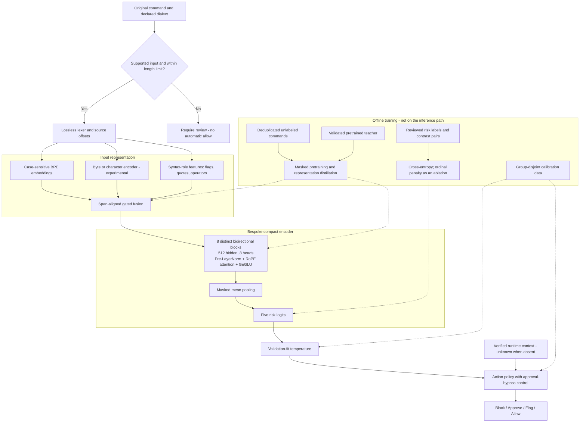

## Proposed stack

**I would start with a compact, bidirectional encoder that combines case-sensitive subwords with an experimental byte/character branch.** This is a bespoke model, not a checkpoint swap. Existing encoders would serve as teachers and benchmark controls.

**[INFERENCE] Design proposal:** the combined stack below has not been trained or benchmarked. Published results support testing its parts, not a claim that the combination will improve command-risk detection.

Solid arrows show inference or data flow. Dashed arrows show training, calibration, or external context.

### Initial configuration

| Component | Proposed starting point |
|---|---|
| Tokenizer | Keep ModernBERT’s case-sensitive, 50,368-token BPE initially. Test a new vocabulary separately. |
| Auxiliary input | Small byte CNN, aligned to each subword’s source span; syntax-role embeddings from a lossless lexer. Compare against **no auxiliary branch**. |
| Encoder | 8 layers, width 512, 8 attention heads; GeGLU intermediate width 1,536. Approximately **53M parameters before the auxiliary branch and classifier**. |
| Attention | Full bidirectional attention for the initial short-command design. Test local/global attention only if longer scripts justify it. |
| Pooling and head | Masked mean pooling → five-class head. Cross-entropy baseline; ordinal loss remains an experiment. |
| Runtime | ONNX Runtime FP32 first. INT8 is a separate candidate that must pass action-level checks. |

The size is a parameter-count estimate, **not a latency estimate**. These dimensions also require new training or distillation; ModernBERT weights cannot be copied unchanged.

## What the benchmark research says

Numbers below are author-reported. Compare results **within a row**, not across different benchmark suites.

| Component alternative | Published evidence | Implication for this stack |
|---|---|---|
| **Subwords + character branch** | [CharBERT](https://aclanthology.org/2020.coling-main.4.pdf) adds about **5M parameters** to BERT-base. On QNLI, clean accuracy was **91.7% vs 90.7%**; under character attacks, **80.1% vs 63.4%**. | Strong reason to test a character side branch. It does **not** establish that a byte CNN will give the same gain. |
| **Fully character-based input** | [CANINE](https://aclanthology.org/2022.tacl-1.5/) reports TyDi QA passage-selection F1 of **66.0 vs 63.2** for mBERT, but training throughput of **6,400 vs 9,000 examples/s** on TPUv3. | Removing the tokenizer is not automatically faster. Keep this as a separate architecture experiment. |
| **Bytes with learned downsampling** | [Charformer](https://arxiv.org/pdf/2106.12672) reports **15.0 training steps/s** for its base model with 3× downsampling, versus **8.2** for byte-level T5; memory was **1.63 vs 3.09 GB/device**, on 16 TPUv3 chips. | Learned compression can reduce byte-sequence cost. This is a seq2seq training comparison, not evidence of lower CPU classifier latency. |
| **LayerNorm/GeGLU vs RMSNorm/SwiGLU** | [ModernBERT’s component ablations](https://aclanthology.org/2025.acl-long.127.pdf), Appendix D, found similar quality for the normalization choices and almost no difference between the two GLUs. Native kernel support influenced its LayerNorm choice. | **Do not treat RMSNorm/SwiGLU as an automatic upgrade.** Start with the simpler export path; measure both on our runtime. |
| **Global vs local/global attention** | ModernBERT reports that local windows of **128 tokens**, with a global layer every third layer, matched all-global downstream quality in its ablations. Its RTX 4090 variable-length short-input throughput was **147.3k tokens/s vs BERT’s 90.2k**—a whole-model, maximum-batch comparison. | Useful for longer inputs. That throughput gain cannot be assigned to attention alone or applied to batch-one CPU inference. |
| **Smaller encoder through distillation** | [TinyBERT](https://aclanthology.org/2020.findings-emnlp.372.pdf): **14.5M parameters**, GLUE test **77.0 vs 79.5** for its 109M teacher, and **9.4×** reported speedup on a K80 GPU. [MiniLM](https://arxiv.org/html/2002.10957v2): **33M parameters** and **2.7×** reported speedup on a P100. | Strong support for testing compact students and distillation. Neither speedup predicts our CPU latency. |
| **Modern small-encoder controls** | [Ettin](https://arxiv.org/html/2507.11412) reports GLUE averages of **79.2 / 83.5 / 87.2** for its **17M / 32M / 68M** encoders. These are pretrained models, not distilled students. | Use these as controls to determine whether the bespoke parts earn their complexity. No validated batch-one CPU timing was found. |
| **MLM vs replaced-token detection** | [ELECTRA](https://arxiv.org/pdf/2003.10555), Table 1: at approximately **14M parameters and matched training FLOPs**, ELECTRA-small scored **79.9 GLUE dev**, versus **75.1** for BERT-small. | Replaced-token detection is a credible pretraining alternative. It adds a training-time generator; detecting replacements is not the same as detecting command risk. |
| **Convolution/attention hybrid backbone** | [LFM2.5 Encoder](https://www.liquid.ai/blog/lfm2-5-encoders) combines short convolutions with attention. Its 230M model reports a **79.29** mean over 17 tasks, versus **78.19** for ModernBERT-base. Its advertised CPU speed advantage concerns long inputs. | Worth tracking for long scripts. Not my default for short commands: it is larger, and its custom architecture needs export/runtime checks. |

One useful counterexample to “newer tokenizer is better”: [NeoBERT](https://arxiv.org/html/2502.19587) reports a **2.1% relative GLUE drop** when replacing WordPiece with LLaMA-2 BPE in its ablation. Tokenizer changes need their own controlled experiment.

## Command-specific constraints

These matter more than small gains on general NLP benchmarks:

- **Preserve exact text.** Case, quotes, escapes, whitespace, and operators can change meaning. Character robustness must not become invariance to changes such as `-d` → `-D` or `>` → `>>`.
- **Prevent masked-token leakage.** During masked pretraining, hide the corresponding byte/character spans too. Otherwise, the auxiliary branch exposes the answer.
- **Keep reviewed labels authoritative.** A teacher can supply representations or soft targets; our current risk classifiers are not reliable enough to serve as label oracles.
- **Treat missing context as missing.** The command alone may not establish path contents, permissions, or remote state.
- **Measure approval bypass explicitly.** Reducing unsafe allows is not enough if commands that require approval instead slip into another action.

## What would decide the design

Our [local comparison](runs/iteration-v3/comparison-summary.json) remains the relevant latency anchor: roughly **0.38 ms p50** for character TF-IDF, **18.44 ms** for the selected ModernBERT, and **17.59 ms** for the selected DeBERTa on the measured CPU setup. Backends differed, and **none passed all historical-test safety gates**.

I would test the proposed stack in this order:

1. **Compact BPE-only encoder** against pretrained small-encoder controls.
2. Add **syntax features** and **byte features separately**, then together.
3. Compare **with and without distillation**; test replaced-token pretraining only as a separate arm.
4. Measure end-to-end **CPU batch-one p50/p95, memory, and action errors**, using the same raw commands—not merely equal token counts.
5. Fit calibration and policy on held-out groups, then use a **fresh, untouched audit set**.
6. Test INT8 only after FP32 is useful. Our previous quantized exports failed the action-agreement gate; smaller tensors alone are not a release criterion.

**Bottom line:** the strongest first bets are a smaller encoder, distillation, and exact byte/character information. Norm swaps and long-context attention tricks are lower-priority experiments for this short-command workload.

*Mermaid syntax and rendering checked. No model training or repository changes were made.*
